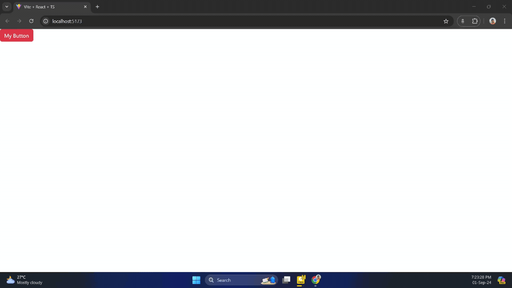

# Exercise - Showing an Alert

- Tip for find alert box with ❌
	- Go to bootstrap latest version's home page (here V 5.3). Never google "alert bootstrap" it will redirect to old version.
	- Search on alert at bootstrap home page
	- on right side corner choose "Dismissing"
  
    